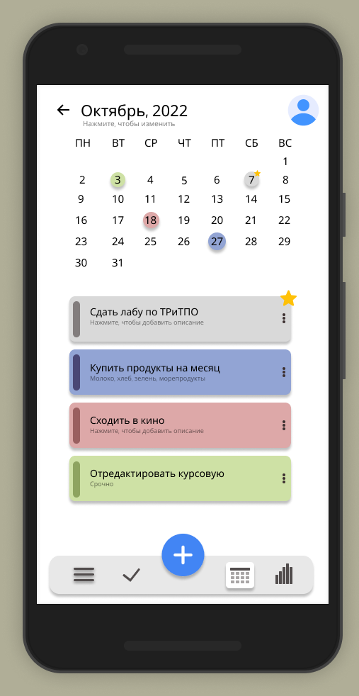
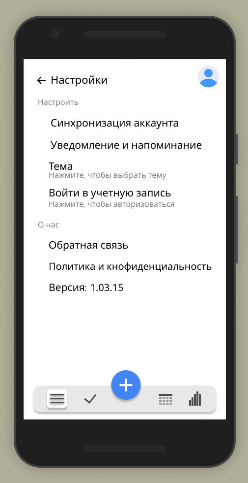
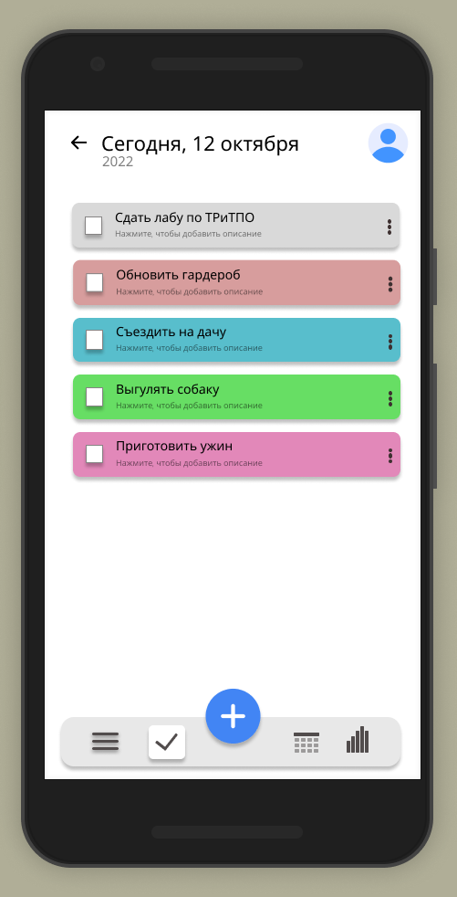
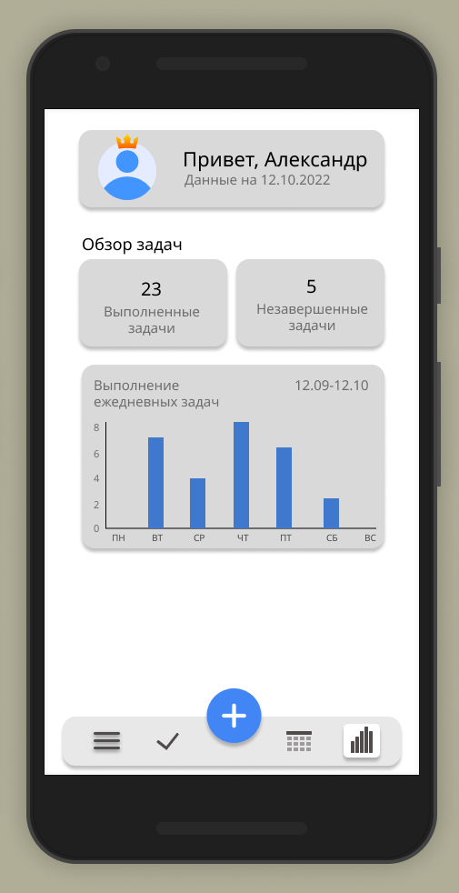
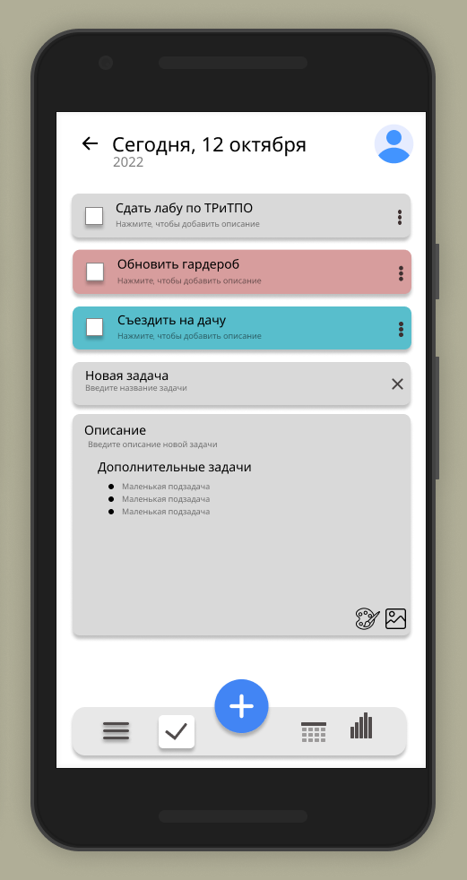

# Требования к проекту
---

# Содержание
1 [Введение](#intro)  
1.1 [Назначение](#appointment)  
1.2 [Бизнес-требования](#business_requirements)  
1.2.1 [Исходные данные](#initial_data)  
1.2.2 [Возможности бизнеса](#business_opportunities)  
1.2.3 [Границы проекта](#project_boundary)  
1.3 [Аналоги](#analogues)  
2 [Требования пользователя](#user_requirements)  
2.1 [Программные интерфейсы](#software_interfaces)  
2.2 [Интерфейс пользователя](#user_interface)  
2.3 [Характеристики пользователей](#user_specifications)  
2.3.1 [Классы пользователей](#user_classes)  
2.3.2 [Аудитория приложения](#application_audience)  
2.3.2.1 [Целевая аудитория](#target_audience)  
2.3.2.1 [Побочная аудитория](#collateral_audience)  
2.4 [Предположения и зависимости](#assumptions_and_dependencies)  
3 [Системные требования](#system_requirements)  
3.1 [Функциональные требования](#functional_requirements)  
3.1.1 [Основные функции](#main_functions)  
3.1.1.1 [Вход пользователя в приложение](#user_logon_to_the_application)  
3.1.1.2 [Настройка профиля активного пользователя](#setting_up_the_profile_of_the_active_user)  
3.1.1.3 [Загрузка новостей](#download_news)  
3.1.1.4 [Просмотр информации об отдельной новости](#view_information_about_an_individual_newsletter)  
3.1.1.5 [Выход пользователя из учётной записи](#active_user_change)  
3.1.1.6 [Регистрация нового пользователя после входа в приложение](#add_new_user)  
3.1.2 [Ограничения и исключения](#restrictions_and_exclusions)  
3.2 [Нефункциональные требования](#non-functional_requirements)  
3.2.1 [Атрибуты качества](#quality_attributes)  
3.2.1.1 [Требования к удобству использования](#requirements_for_ease_of_use)  
3.2.1.2 [Требования к безопасности](#security_requirements)  
3.2.2 [Внешние интерфейсы](#external_interfaces)  
3.2.3 [Ограничения](#restrictions)  

<a name="intro"/>

# 1 Введение

<a name="appointment"/>

## 1.1 Назначение
В этом документе описаны функциональные и нефункциональные требования к приложению «Мой ежедневник» для Android.

<a name="business_requirements"/>

## 1.2 Бизнес-требования

<a name="initial_data"/>

### 1.2.1 Исходные данные
Бльшинство людей средней  и старшей возрастной категории в связи с ростом ответственности и обязанностей вынуждены прибегнуть к планированию своих будней. Большинсво из них не обладает достаточной технической грамотностью для использования приложений, рассчитанных на продвинутых пользователей. Дополнительные трудности возникают из-за того, что эти приложения зачастую не рассчитаны на использование людьми с плохим зрением. Это приводит к тому, что многие возвращаются к привычным способам получения информации.

<a name="business_opportunities"/>

### 1.2.2 Возможности бизнеса
Большинство людей средней  и старшей возрастной категории в связи с ростом ответственности и обязанностей вынуждены прибегнуть к планированию своих будней, обладая минимальой технической грамотностью. Подобное приложение позволит им тратить меньше времени в пустую. Интерфейс, спроектированный с учётом всех особенностей данной возрастной категории, и дополнение приложения подробной инструкцией позволят увеличить количество людей, использующих данное приложение.

<a name="project_boundary"/>

### 1.2.3 Границы проекта
В приложении доступна платная и бесплатная версия. Пользователи бесплатной версии ограничены количеством задач на день, а так же планированием более чем на месяц вперед. В платной версии указанные выше ограничения снимаются. Помимо этого появляется возможность просмотра статистики за определенный период.
	Пользователи могут использовать приложение анонимно, либо пройдя регистрацию. Анонимное пользование накладывает следующие ограничения: отсутствует возможность синхронизации данных с сервером, данные восстановлению не подлежат. Все записи задач при удалении приложения с устройства будут утеряны, так как данные расположены локально. Зарегистрированные пользователи могут восстановить ранее сохраненные данные, например, на другое устройство.

<a name="user_requirements"/>

# 2 Требования пользователя

<a name="software_interfaces"/>

## 2.1 Программные интерфейсы
Проект разрабатывается в рамках платформы  .NET на языке C# с применением соответствующих библиотек платформы. Для реализации ПО под мобильное устройства будет задействован фреймворк Xamarin. Взаимодействие с базой данных осуществляется через фреймворк Entity. Язык запросов – SqlServer. 

<a name="user_interface"/>

## 2.2 Интерфейс пользователя
Окно задач в рамках месяца

  

Окно настроек 

  

Окно задач на сегодня

  

Окно статистики

  

Окно добавления задачи 

<a name="user_specifications"/>

## 2.3 Характеристики пользователей

<a name="user_classes"/>

### 2.3.1 Классы пользователей

| Класс пользователей | Описание |
|:---|:---|
| Анонимные пользователи | Пользователи, которые не хотят регистрироваться в приложении. Имеют доступ к частичному функционалу |
| Зарегистрированные пользователи | Пользователи, которые вошли в приложение под своим именем (псевдонимом). Имеют доступ к полному функционалу не включая функции платной подписки |
| Пользователи с подпиской | Пользователи, которые преобрели платную подписку. Имеют доступ к полному функционалу |

<a name="application_audience"/>

### 2.3.2 Аудитория приложения

<a name="target_audience"/>

#### 2.3.2.1 Целевая аудитория
Люди старшей возрастной категории со средним или выше среднего уровнем образования, обладающие минимальной технической грамотностью.

<a name="collateral_audience"/>

#### 2.3.2.2 Побочная аудитория
Люди средней возрастной категории, обладающие вышеперечисленными качествами.

<a name="assumptions_and_dependencies"/>

## 2.4 Предположения и зависимости
1. Приложение не работает при отсутствии подключения к Интернету;

<a name="system_requirements"/>

# 3 Системные требования

<a name="functional_requirements"/>

## 3.1 Функциональные требования

<a name="main_functions"/>

### 3.1.1 Основные функции

<a name="user_logon_to_the_application"/>

#### 3.1.1.1 Вход пользователя в приложение
**Описание.** Пользователь имеет возможность использовать приложение без создания собственного профиля либо войдя в свою учётную запись.

| Функция | Требования | 
|:---|:---|
| Вход в приложение без создания собственного профиля | Приложение должно предоставить пользователю возможность войти в приложение анонимно |
| Вход зарегистрированного пользователя в приложение | Приложение должно предоставить пользователю список имён (псевдонимов) зарегестрированных пользователей. Пользователь должен либо выбрать из списка своё имя (псевдоним), либо отменить действие |

<a name="setting_up_the_profile_of_the_active_user"/>

#### 3.1.1.2 Редактирование задач
**Описание.** Пользователь редактирует, создает и удаляет задачи в соотвествии с календарем.
 
| Функция | Требования | 
|:---|:---|
| Добавление задачи на день | Пользователю необходимо заполнить необходимую информацию для создания новой задачи. Это включает в себя название задачи, описание, если необходимо, пометку, необходимо ли уведомить пользователя о задаче, если да, то когда |
| Добавление задачи с привязкой к календарю | Аналогичные действия прошлому пункту. Однако вдобавок необходимо указать запланированную дату |
| Редактирование задач | Позволяет отредактировать  ранее заполняемые поля пользователем|

<a name="download_news"/>

#### 3.1.1.3 Манипуляции с задачами
**Описание.** Пользователь просматривает задачи, помечает выполненные задачи.

| Функция | Требования | 
|:---|:---|
| Отметка о выполнение | Пользователь помечает задачу выполненной, что влечет за собой отключение уведомлений касаемо этой задачи. Выполненные задачи помещаются в хранилище |
| Просмотр задач | Пользователь просматривает задачи |

<a name="view_information_about_an_individual_newsletter"/>

#### 3.1.1.4 Дополнительные функции
**Описание.** Пользователь платной подписки имеет расширенный функционал.

| Функция | Требования | 
|:---|:---|
| Смена цветовой гаммы приложения | После приобретения платной подписки пользователь может сменить тему приложения. На выбор предоставляется темная и светлая тематика |
| Смена фона отдельных задач | Позволяет пользователям с подпиской сменить задний фон просмотра задачи. Требования: на выбор предлагается градиент, внутренние изображения, сплошным цветом, внешние изображения на устройстве |
| Планирование задачи более чем на месяц вперед |Расширяет ранее доступный функционал, снимая ограничение |

<a name="active_user_change"/>

### 3.1.2 Ограничения и исключения
1. Приложение работает только при наличии подключения к Интернету;

<a name="non-functional_requirements"/>

## 3.2 Нефункциональные требования

<a name="quality_attributes"/>

### 3.2.1 Атрибуты качества

<a name="requirements_for_ease_of_use"/>

#### 3.2.1.1 Требования к удобству использования
1. Доступ к основным функциям приложения не более чем за две операции;
2. Все функциональные элементы пользовательского интерфейса имеют названия, описывающие действие, которое произойдет при выборе элемента;

<a name="security_requirements"/>

#### 3.2.1.2 Требования к безопасности
Приложение предоставляет возможность просмотра и редактирования профиля только активного пользователя.

<a name="external_interfaces"/>

### 3.2.2 Внешние интерфейсы
Окна приложения удобны для использования пользователями с плохим зрением:
  * размер шрифта не менее 14пт;
  * функциональные элементы контрастны фону окна.

<a name="restrictions"/>

### 3.2.3 Ограничения
1. Приложение реализовано на платформе .NET Framework 4.6;
2. Профиль пользователя хранится в файле с расширением XML, название файла совпадает с именем (псевдонимом).
